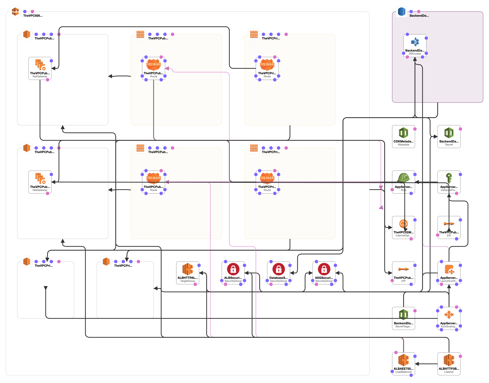

# Welcome to your CDK TypeScript project!

In this CDK Project, I have created a VPC, with 2 Subnets (private and public), This network hosts an application server that uses EC2, It also has Load Balancer and an Autoscaling group configuration.

The `cdk.json` file tells the CDK Toolkit how to execute your app.

## Useful commands

 * `npm run build`   compile typescript to js
 * `npm run watch`   watch for changes and compile
 * `cdk deploy`      deploy this stack to your default AWS account/region
 * `cdk diff`        compare deployed stack with current state
 * `cdk synth`       emits the synthesized CloudFormation template

 ## Cloudformation 
 
I have added an additional folder answers/Infrastructure/Cloudformation, This will give you the synthesized stack in cloudformation. 
* You may create the stack after downloading CDK, and exexcuting `npm install` and running `cdk deploy`, To destory the stack please use `cdk destroy`.
